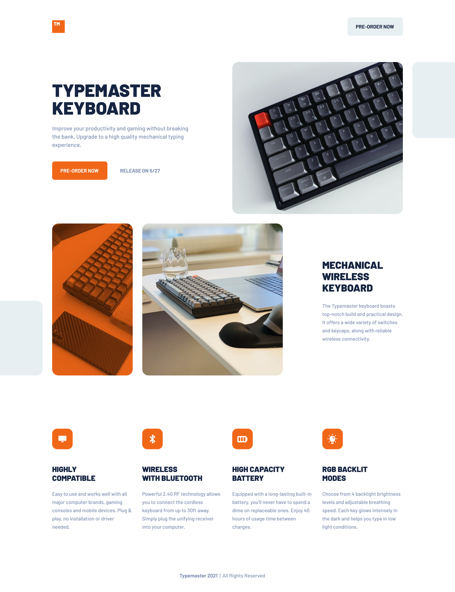

# Portfolio Adam Keyes

## Descripción del proyecto :memo:

Este proyecto se corresponde con la web de <b><i>"TYPEMASTER KEYBOARD"</i></b>, un teclado inalámbrico de alta calidad que mejorará tu productividad y
 experiencia de juego sin romper tu bolsillo Sus principales virtudes se aprecian de un sólo golpe de vista en cuanto accedes al sitio:

- **Diseño mecánico y ergonómico:** Disfruta de una experiencia de escritura cómoda y precisa.
- **Conectividad inalámbrica:** Olvídate de los cables y conéctate fácilmente a través de Bluetooth o USB.
- **Compatibilidad universal:** Funciona con Windows, macOS, iOS y Android.
- **Retroiluminación RGB:** Personaliza la iluminación de tu teclado con una amplia gama de colores y efectos.
- **Batería de larga duración:** Disfruta de hasta 40 horas de uso inalámbrico con una sola carga.
- **Diseño compacto y ligero:** Llévalo contigo a donde quieras.
  
 
En el desarrollo del sitio se han utilizado las siguientes tecnologías:

- <b>HTML:</b> Estructura básica de la página y contenido.
- <b>CSS:</b> Para configurar el diseño visual del contenido.
- <b>Sass:</b> Preprocesador CSS para crear estilos modulares y mantenibles.
- <b>Vite:</b> Herramienta de desarrollo web de alta velocidad para una experiencia de desarrollo más rápida y optimizada.

## Vista previa del diseño :clipboard:

El sitio cuenta con un diseño responsive que se adapta a diferentes tamaños de pantalla 🖥️:

- Móvil: hasta 768px
- Tablet: de 768 px hasta 1200px
- Escritorio: a partir de 1200px

En la siguiente imagen se aprecia un detalle del resultado obtenido (versión de escritorio):

## Uso :point_left:

Puedes reutilizar el código para tu propio proyecto web. Simplemente descárgate el repositorio y añádele los cambios necesarios para integrarlo en tu sitio.

## Contribuciones :information_desk_person:

¡Se aceptan contribuciones, claro que sí! Si encuentras algún problema o tienes alguna sugerencia de mejora, no dudes en ponerte en contacto conmigo y aportar tus ideas. Te lo agradeceré infinitamente :handshake:

 
